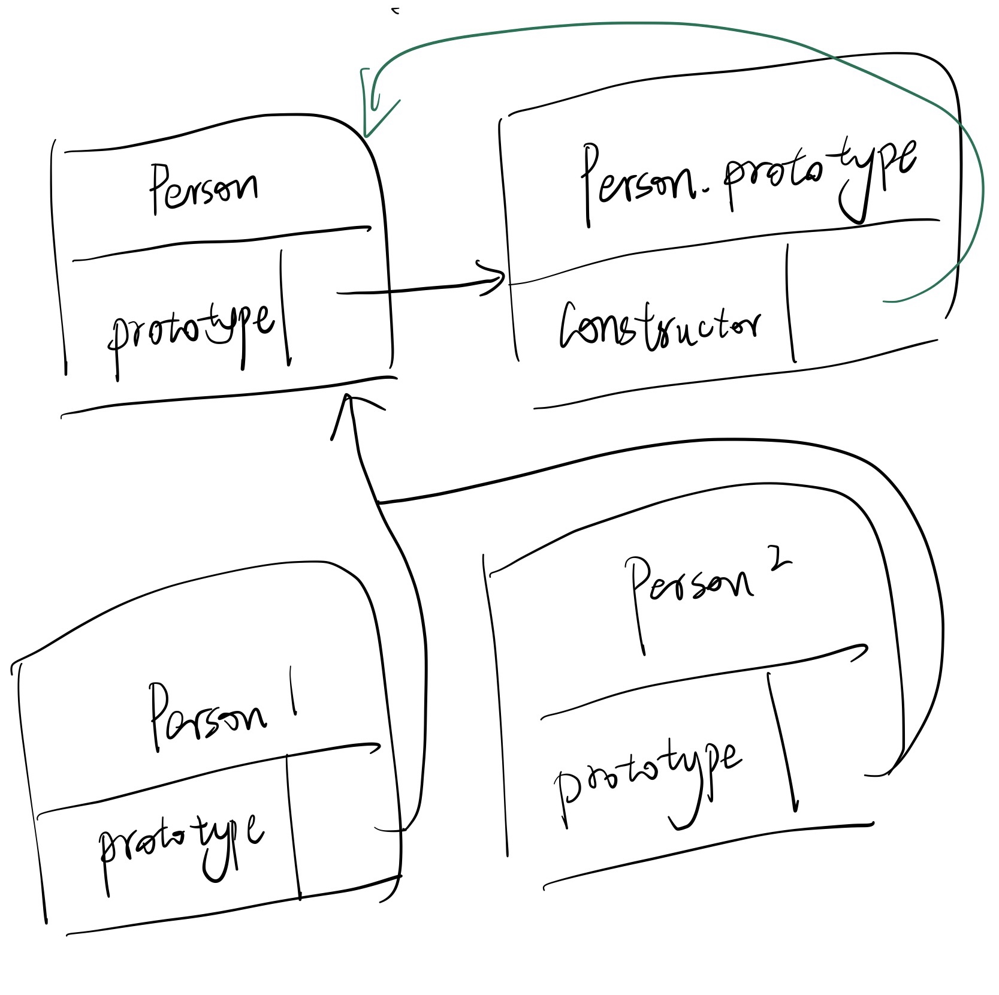

### 1. 原型

&emsp;&emsp;每个函数都会创建一个prototype属性，这个属性是一个对象，包含应该由特定引用类型的实例共享的属性和方法。实际上这个对象就是通过调用构造函数创建的对象的原型。这么讲太绕了。简而言之，就是构造函数的prototype是一个对象，其他函数的prototype是一个指向其对应的构造函数的prototype对象的指针。同时，所有prototype对象都有一个constructor属性指向与之相关的构造函数。

<!-- more -->

&emsp;&emsp;我的理解是这样：



&emsp;&emsp;在自定义构造函数时，原型对象默认只会获得constructor属性，其他属性都继承自Object。脚本中没有访问实力的prototype的标准方式，但是chrome、firefox、safari都会在每个对象上暴露\_proto_属性，通过这个属性可以访问对象的原型。实际上实例与构造函数原型有直接的关系，但是实例和构造函数是没有直接的关系的。

&emsp;&emsp;用代码来理解：

```javascript
function Person(){}

console.log(Person.prototype);
/*
{
	constructor: function Person(),
	_proto_: Obkect
}
*/

console.log(Person.prototype.constructor === Person) //true

//正常的原型链都会终止于Object的原型对象
//Object的原型是null
console.log(Person.prototype._proto_ === Object.prototype)//true
console.log(Person.prototype._proto_.constructor === Object)//true
console.log(Person.prototype._proto_._proto_ === Object)//true


let person1 = new Person(), person2 = new Person();

//构造函数、原型对象和实例是三个完全不同的对象
console.log(person1 !== Person)//true
console.log(person1 !== Person.prototype)//true
console.log(Person.prototype !== Person)//true

/*
* 实例通过_proto_链接到原型对象
* _proto_其实就是实例的隐藏特性prototype
*/
console.log(person1._proto_ === Person.prototype)//true
console.log(person1._proto_.constructor === Person)//true

//同一个构造函数的两个实例共享同一个原型对象
console.log(person1._proto_ === person2._proto_)//true

//instanceof检查实例的原型链中是否包含指定构造函数的原型
console.log(person1 instanceof Person)//true
console.log(person1 instanceof Object)//true
console.log(Person.prototype instanceof Object)//true
```

&emsp;&emsp;在通过对象访问属性时，会按照这个属性的名称开始搜索，搜索开始于对象实例本身。如果在这个实例上发现了给定的名称，则返回给定名称对应的值，如果没有找到这个属性，则会沿着指针进入原型对象，在原型对象中进行搜索。如果在原型对象中找到属性，则返回对应的值。这就是多个对象实例之间共享属性和方法的原理。

&emsp;&emsp;虽然可以通过实例读取原型对象上的值，但是不能通过实例修改原型对象上的值。如果在实例上添加了一个与原型对象中同名的属性，那就会在实例上创建这个属性。这个属性会遮住原型对象上的属性。同时会**遮蔽（shadow）**对原型对象上同名属性的访问。把原型对象上的这个属性设置为null并不能恢复其与原型的联系，只有使用`delete`操作符才可以删除实例上的这个属性，从而让解析过程能够继续搜索原型对象。