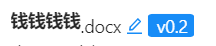

&emsp;&emsp;在写代码的过程中，出现了这样的情况：



&emsp;&emsp;很明显这几个元素处于同一行，但为什么它们高度不一样呢？那是因为我为了设置最前面文件名的宽度，把它的display改成了inline-block（这里再次强调，行内元素不能设置宽高！老是忘掉）。inline-block的元素和块级元素一样，会默认上下居中。

&emsp;&emsp;出现这种问题，不用怕！简单的CSS问题，下面来讲讲我在公司刚学的三种解决方法。（顺便说一句，用F12调试既能改css有能改html，请大家遇到样式问题的时候多使用F12！）

<!-- more -->

&emsp;&emsp;我原本的html结构是这样的：

&emsp;&emsp;很显然，现在的问题就是让这个filename和docx对齐。

###  1. flex布局

&emsp;&emsp;flex布局其实是父级元素对子元素的一种操控，那这段html代码其实有一个问题啊，就是这个.docx他其实是不属于跟filename同级元素的，它属于filename的父元素，那么我们需要给.docx套一个span，使它和filename变成兄弟元素。

```html
<span>.docx</span>
```

&emsp;&emsp;然后在它们的父元素中写CSS样式:

```css
display:flex;
align-items: baseline;
```

&emsp;&emsp;诶，这样一搞其他span被挤到下面去了，原来flex类似于块级元素。怎么办？不怕！既然有inline-block，肯定也有inline-flex啊，一看还真有，改成inline-flex就解决了。

### 2. Position

&emsp;&emsp;有啥问题是position解决不了的呢，用position,不用多说了，直接上代码：

```css
.{
    positon:relative;
}
```

```css
.{
    position:relative;
    bottom:-3x;
}
```

### 3. vertical-align

&emsp;&emsp;也直接上代码：

```
.{
	vertical-align:bottom
}
```

